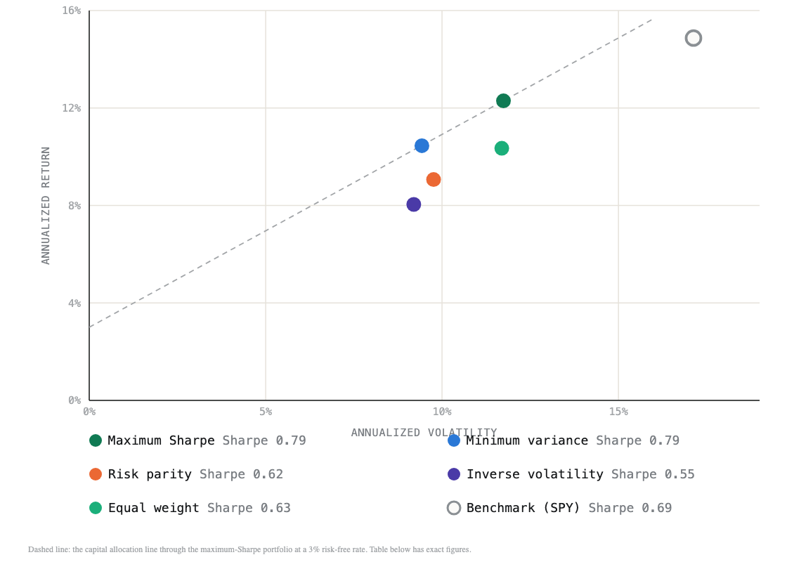

# Quantitative Portfolio Research Pipeline

[](https://github.com/Nathan-Gomes/quant-portfolio-research/actions/workflows/validate.yml)


A reproducible research-to-production workflow for constrained ETF portfolio optimization. The project combines Python, pandas, SQL, SciPy, MATLAB, automated testing, and a browser-based research report. Weights are solved under constraints, estimated with shrinkage, compared against naive baselines on identical dates, checked for sensitivity to every assumption, and cross-checked by an independent MATLAB implementation that runs in CI.

[Live report](https://www.nathan-gomes.com/quant-portfolio-report.html) | [Portfolio page](https://www.nathan-gomes.com/Project-Quant-Portfolio.dc.html)

## How to review this

Start with the short [review guide](docs/REVIEW_GUIDE.md). It explains the research question, the walk-forward decision flow, where the important calculations live, and the limits of the result without requiring a line-by-line code review.

## Research question

Can a long-only, diversified ETF portfolio with a 30% asset cap improve risk-adjusted performance relative to an SPY benchmark when weights are estimated only from prior data and transaction costs are included?

**And the harder question underneath it:** did solving for weights beat not bothering? Comparing an optimizer only with SPY asks whether the asset mix was better. Comparing it with equal weight asks whether the optimization earned its keep, which is the question a portfolio team actually argues about.



| Rule | Annual return | Volatility | Sharpe | Max drawdown | Turnover a year |
| --- | ---: | ---: | ---: | ---: | ---: |
| Maximum Sharpe | 12.30% | 11.74% | **0.79** | −18.4% | 0.89 |
| Minimum variance | 10.45% | 9.43% | 0.79 | −18.6% | 0.38 |
| Risk parity | 9.07% | 9.76% | 0.62 | −19.7% | 0.25 |
| Inverse volatility | 8.04% | 9.20% | 0.55 | −19.5% | 0.28 |
| Equal weight | 10.35% | 11.69% | 0.63 | −22.0% | 0.20 |
| Benchmark (SPY) | 14.87% | 17.13% | 0.69 | −24.5% | n/a |

Every rule is run on identical rebalance dates and identical training windows, so a difference between two of them comes from the rule rather than from a luckier schedule.

Optimizing helped here: maximum Sharpe reached 0.79 against 0.63 for equal weight. That is not a general law, and it is worth stating why it might hold in this universe and not elsewhere: six ETFs spanning bonds, gold and four equity regions have genuinely different risk profiles, so the covariance carries structure worth exploiting. On a more correlated single-country stock universe the same class of optimizer loses to equal weight, which is the DeMiguel, Garlappi and Uppal (2009) result.

### Does the conclusion survive its assumptions?

`outputs/sensitivity_grid.csv` varies the lookback, the cap, the cost and the covariance estimator one at a time. Maximum Sharpe ranks first in 9 of the 11 configurations tried and minimum variance in the other 2, so the finding is not an artifact of one setting. One caveat is built into the output: a longer lookback also starts the evaluation later, which raises every strategy's Sharpe including the benchmark's, so rows are comparable within themselves and not across.

## What this solves

Investment research can look convincing when it is only a spreadsheet or one-off notebook. This project turns the research process into a repeatable pipeline where assumptions, data, calculations, constraints, costs, and validation checks are visible.

The goal is not to prove that one portfolio always wins. The goal is to show how a quantitative research idea can be implemented, tested, backtested, documented, and reviewed before anyone would trust it.

## Pipeline

1. Download and freeze adjusted daily ETF prices from Yahoo Finance's chart endpoint.
2. Normalize the observations and load them into SQLite.
3. Use SQL CTEs, joins, and window functions for monthly return analysis and ranking.
4. Calculate returns, covariance, correlation, volatility, Sharpe ratio, drawdown, and historical VaR, with Ledoit-Wolf and James-Stein shrinkage estimators alongside the sample versions.
5. Solve minimum-variance and maximum-Sharpe allocations with long-only weight constraints, and run equal-weight, inverse-volatility, risk-parity, and static-allocation baselines through the identical walk-forward engine for a paired comparison.
6. Run a quarterly walk-forward backtest with a 36-month lookback and turnover costs.
7. Vary the lookback, cap, cost, and estimator one at a time to check the finding isn't an artifact of one setting.
8. Validate the calculations, constraints, and solver optimality with pytest, and cross-check the optimizers against an independent MATLAB implementation under Octave.
9. Generate an interactive HTML research report.

## Key outputs

- Latest optimized portfolio weights
- Portfolio versus benchmark performance, and versus every naive baseline on identical rebalance dates
- Annualized return, volatility, Sharpe ratio, maximum drawdown, and VaR
- Correlation heatmap across assets
- Drawdown chart for the optimized strategy and benchmark
- Rebalance history and turnover cost impact
- Sensitivity grid across lookback, cap, cost, and estimator
- Python versus independent MATLAB optimizer comparison, verified in CI

## Why it is relevant

This mirrors the work of a quantitative developer supporting a research team:

- Convert market data into clean, queryable research tables
- Implement financial calculations in Python and pandas
- Use SQL for analysis and data checks
- Solve constrained optimization problems
- Avoid look-ahead bias through walk-forward testing
- Package the results into a report that non-developers can review
- Add tests so calculations can be trusted and rerun

## Run

```bash
python3 scripts/fetch_market_data.py
pip install -r requirements.txt
pip install cvxpy               # test-only: checks the SLSQP answer against a certified convex optimum
python3 run_pipeline.py
pytest
octave --no-gui matlab/verify_against_python.m   # optional locally; runs in CI either way
```

Open `outputs/research_report.html` in a browser.

The generated report is also published on the portfolio site as the live project artifact.

## Configuration

All research assumptions live in `config/research.yaml`. Changing the lookback, rebalance frequency, weight cap, transaction cost, or risk-free rate reruns the complete experiment.

## MATLAB

`matlab/minimum_variance_portfolio.m` and `matlab/risk_parity_portfolio.m` re-solve both optimizers independently: accelerated projected gradient and closed-form coordinate descent, written out rather than delegated to `quadprog` and the Optimization Toolbox. `run_pipeline.py` exports the covariance matrix the weights were actually solved from, and `matlab/verify_against_python.m` re-solves and asserts agreement rather than printing numbers for a human to compare. It runs in GNU Octave, so no MATLAB licence is required, and [CI runs it on every push](.github/workflows/validate.yml).

Setting this up properly surfaced a real defect: the exported covariance was the full-sample matrix while the published weights were fitted to the latest 36-month window, so the cross-check had been comparing the answer to a different problem than the one it claimed to verify. The comparison now uses the matrix the weights were actually solved from, and agrees to 6e-7.

## Limitations

- Historical adjusted prices are not a forecast of future returns.
- The ETF universe is intentionally small and may create selection bias.
- The backtest models transaction costs but not taxes, bid-ask variation, or market impact.
- Yahoo Finance data is used for educational research and should not be treated as an institutional market-data source.
- Results are educational and are not investment advice.
